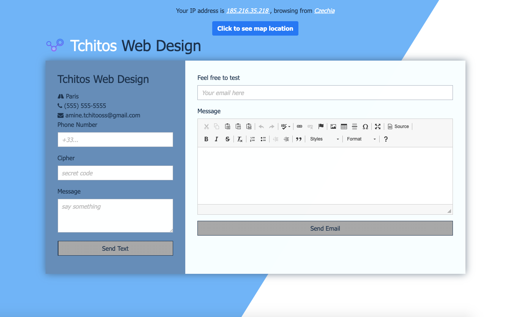
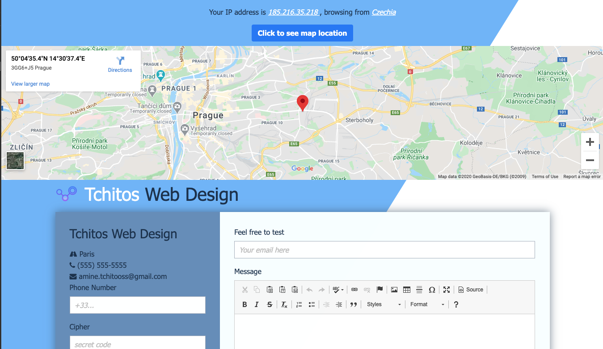

# A node.js project for :

> Sending emails with wysiwyg feature 

> Senfing SMS via TWilio service

> Tracing your IP geolocation.

### Home Page



### Toggle location of IP




## 1- Modules used below

> ### @hapi/joi ###
 >for creating blueprints or schemas for JavaScript objects to ensure validation of key information.

> ### body-parser ###
>for body parsing middleware.

> ### nodemailer ###
>for Node.js applications to allow easy as cake email sending.

> ### Twilio ###
>for sending texts Twilio is a cloud communications platform


## 2- how to use
  
  Make sure to set up a ".env" config file to set up variables like mail and password
  then run these commands 
  
```bash
npm i

npm start

#with nodemone (restart server with every save)
npm run dev

```

> FOR INLINING HTML 
https://templates.mailchimp.com/resources/inline-css/

>FOR SETTING UP THE GMAIL AUTH PROCESS: --> 
https://www.youtube.com/watch?v=JJ44WA_eV8E


>NOTE for responsive HTML mails: --> 
https://www.youtube.com/watch?v=FrB8mxdWR7o
